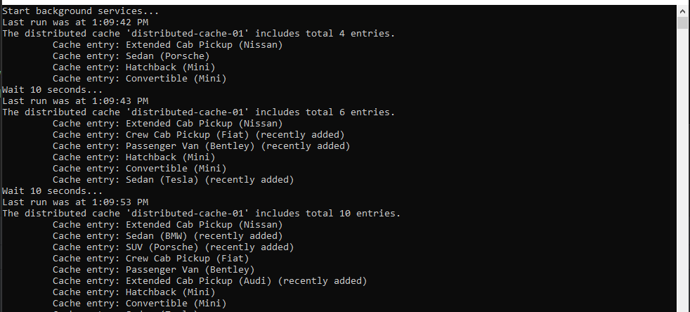

# Standlone.Infinispan.config
This project enables the use of a standalone distributed cache ([Infinispan](https://infinispan.org/)) and provides functionality for interacting with the cache. Infinispan is an open-source, in-memory data store capable of holding various types of data, ranging from plain text to structured objects.

# Overview

The project showcases how to write data to the cache and read it back using an Infinispan server running locally. It includes the following applications:
 - `Producer` is responsible for sending data to distributed cache. It’s connected with the data API.
 - `Consumer` reads and processes data from the distributed cache.
 - `Monitor` is the application that monitors statistics for the distributes cache.

The following versions are available:
- [Infinispan 14.0](14.0/src/)

The sequence diagram describes all details:
- The Infinispan cluster consists of three instances.
- Applications use authentication credentials.
- All three applications interact with the distributed cache.


# How does it work?

- Run the Infinispan cluster:
  - Navigate to the appropriate directory, e.g., `14.0\src\docker`;
  - Use the command:`docker compose up`;
  - The cluster will be available at:
    - instance-01 `http://localhost:11222/console/`
    - instance-02 `http://localhost:11223/console/`
    - instance-03 `http://localhost:11224/console/`
  - Authentication credentials are stored in the `.env` file:
    - Admin login: `CACHE_ADMIN_LOGIN`;
    - Admin password: `CACHE_ADMIN_PASSWORD`.
  - For more details on roles and permissions below;
  - Size of caches (in megabytes) are available in the `.env` file;
  - For instance, `Infinispan 14.0` console:


- Run the solution:
  - Open the solution file, e.g., `14.0\Standlone.Infinispan.14.Solution.sln`;
  - Run multiple projects in the solution/

## Infinispan user roles and permissions
More details about roles and permissions are available with the [link](https://infinispan.org/docs/stable/titles/security/security.html#default-user-roles_security-authorization)

| Role | Username | Password | Used in Application |
| -------- | -------- | -------- | -------- |
| Reader (`observer`) | Reader1 | 123qweASD | `Consumer` |
| Writer (`application`) | Applicant1 | 123qweASD | `Producer` |
| Monitor (`monitor`) | Monitor1 | 123qweASD | `Monitor` |


## Producer
The application generates new data (e.g., car models) every 10 seconds. The `Infinispan 14.0` sample:


Sample model for writing to the cache:
```csharp
public sealed class WritableCarModel : CacheBaseModel
{
    [JsonPropertyName("manufacturer")] public string? Manufacturer { get; set; }

    [JsonPropertyName("type")] public string? Type { get; set; }

    [JsonPropertyName("model")] public string? Model { get; set; }

    [JsonPropertyName("createdUtcAt")] public DateTime CreatedUtcAt { get; set; } = DateTime.UtcNow;
}
```
Base model (shared across applications):
```csharp
public abstract class CacheBaseModel
{
    [JsonIgnore]
    public Guid CacheKey { get; set; }
    
    [JsonIgnore]
    public int TimeToLiveInSeconds { get; set; } = -1;
}
```

The cache should have the data `Infinispan 14.0` sample:


## Consumer
The application reads data from the cache every 10 seconds. The `Infinispan 14.0` sample:


Model used for reading:
```csharp
public sealed class ReadableCarModel : CacheBaseModel
{
    [JsonPropertyName("manufacturer")] public string? Manufacturer { get; set; }
    [JsonPropertyName("type")] public string? Type { get; set; }

    [JsonPropertyName("model")] public string? Model { get; set; }
    [JsonPropertyName("createdUtcAt")] public DateTime CreatedUtcAt { get; set; } = DateTime.UtcNow;
}
```

## Monitor
The application retrieves basic statistics (e.g., total count, key-value types) for the cache (our case is `distributed-cache-01`). The `Infinispan 14.0` sample:


Model used for statistics:
```csharp
public class StatsModel: CacheBaseModel
{
    [JsonPropertyName("stats")]
    public required Stats Stats { get; set; }
    
    [JsonPropertyName("key_storage")]
    public required string KeyStorageType { get; set; }
    
    [JsonPropertyName("value_storage")]
    public required string ValueStorageType { get; set; }
    
    [JsonPropertyName("queryable")]
    public required bool IsQueryable { get; set; }
}
```

# References
- [Cache modes in Infinispan 14.0](https://infinispan.org/docs/14.0.x/titles/configuring/configuring.html#cache-modes_caches)
- [Clustered caches in Infinispan 14.0](https://infinispan.org/docs/14.0.x/titles/configuring/configuring.html#clustered-caches)
- [Security overview of Infinispan](https://infinispan.org/docs/stable/titles/security/security.html)
- [Cache configuration in Infinispan 14.0](https://infinispan.org/docs/14.0.x/titles/configuring/configuring.html#cache-configuration)

